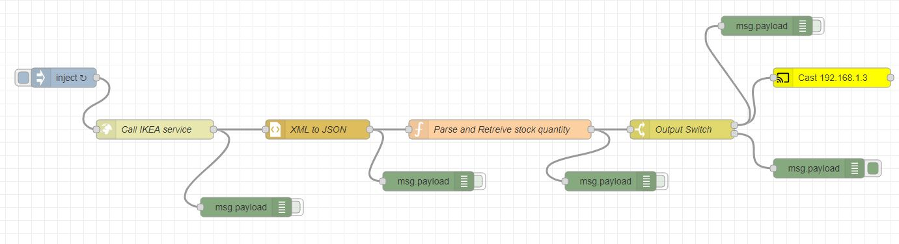

## Ikea Stock Availability Alerter
A Home Automation System, using Node Red and Google Home, to alert on Stock Availability of IKEA products.

## About
* This is an Home Automation Project, using Google Home.
* It checks the IKEA store for stock availability of a specific product.
* Once the product is available, it announces the availability on Google Home (can support chromecast, home devices)
* The frequency of checking the URL, can be configured.
* It's implemented with Node-Red processing flows.


# Screenshot of the Node Red Flow


# Flow code
```
[{"id":"d0725df5.9107d","type":"debug","z":"8650fec8.92341","name":"","active":true,"tosidebar":true,"console":false,"tostatus":false,"complete":"false","statusVal":"","statusType":"auto","x":1430,"y":440,"wires":[]}]
```
